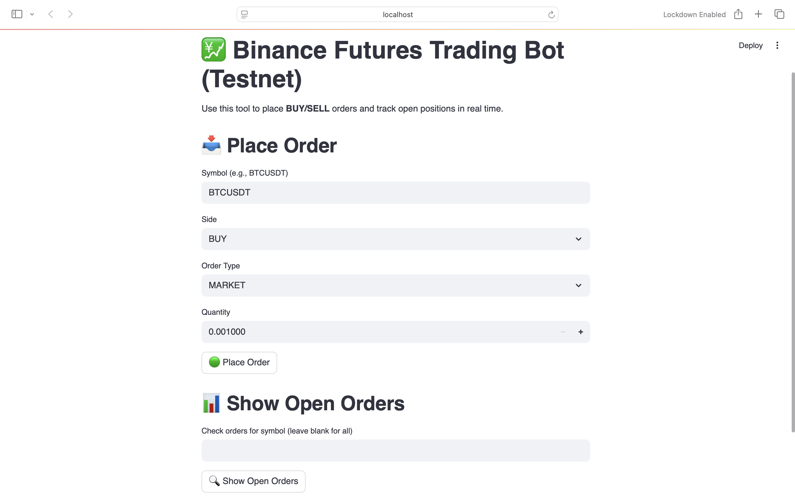

#  Binance Futures Trading Bot (Testnet)

A beginner-friendly, Python-based trading bot built for the **Binance Futures Testnet (USDT-M)**.  
It supports market and limit orders, stop-limit orders, real-time open order tracking, and includes a clean Streamlit-based UI.

> Built as part of a Junior Python Developer assignment for PrimeTrade.AI

---

##  Features

- Place **Market** and **Limit** Orders (BUY/SELL)
- Support for **Stop-Market (Stop-Limit)** Orders
- **Track Open Orders** in real-time
- Streamlit UI for easy interaction
- CLI version available
- API logging (`bot.log`) and error handling
- Environment-secured API key loading with `.env`

---

## Tech Stack

- **Python 3.10+**
- [python-binance](https://github.com/sammchardy/python-binance)
- [Streamlit](https://streamlit.io)
- `dotenv` for environment variable management

---

## Setup Instructions

### 1. Clone the Repository

git clone https://github.com/lavanya9182/binance-trading-bot-v2.git
cd binance-trading-bot-v2

### 2. Install Dependencies

pip install -r requirements.txt

### 3. Set Up .env File
Create a .env file in the root directory with your Binance Testnet API credentials:
env
API_KEY=your_testnet_api_key
API_SECRET=your_testnet_api_secret

Use only Binance Futures Testnet credentials from https://testnet.binancefuture.com

### Running the Application

Option 1: Streamlit UI
streamlit run streamlit_app.py

Option 2: Command-Line Mode
python main.py

 Project Structure

binance-trading-bot-v2/
├── bot.py               # Bot logic using Binance API
├── main.py              # CLI entry point
├── streamlit_app.py     # Streamlit UI
├── logger.py            # Logging setup
├── cli.py               # CLI input handler (optional)
├── requirements.txt     # Project dependencies
├── .env                 # Your API keys (DO NOT COMMIT)
├── .gitignore           # Git ignore rules
└── bot.log              # API logs and order history
 Log File
All API responses and errors are recorded in bot.log for easy debugging and tracking.

